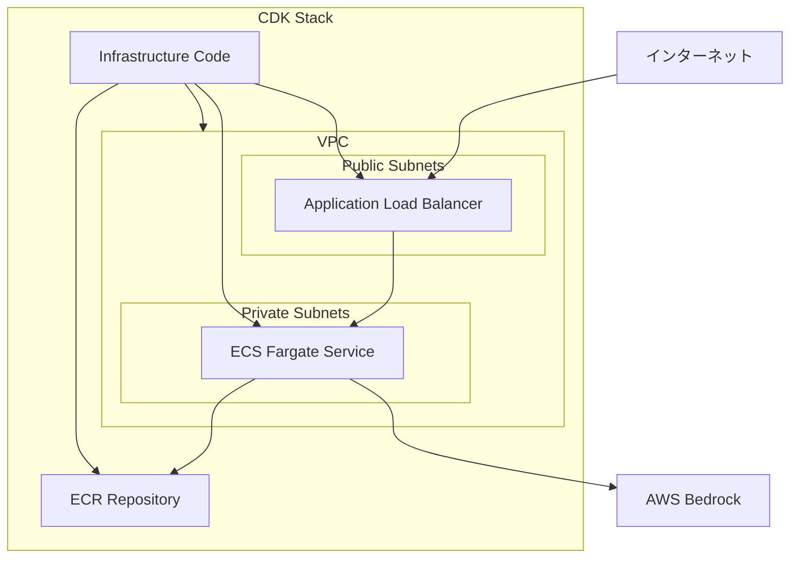

# 設計書

## 概要

PE-GPTアプリケーションをAmazon ECS Fargateでコンテナ化し、Application Load Balancer（ALB）を使用してインターネットからアクセス可能にする。AWS CDK（TypeScript）を使用してInfrastructure as Codeでリソースを管理する。

## アーキテクチャ

### 全体アーキテクチャ



### ネットワーク構成

- **VPC**: 専用の仮想プライベートクラウド
- **Public Subnets**: ALBを配置（2つのAZ）
- **Private Subnets**: ECSタスクを配置（2つのAZ）
- **Internet Gateway**: インターネット接続
- **NAT Gateway**: プライベートサブネットからのアウトバウンド接続

## コンポーネントと インターフェース

### 1. Dockerコンテナ

#### ベースイメージ
- `python:3.11-slim` - 軽量なPythonランタイム

#### コンテナ構成
```dockerfile
FROM python:3.11-slim

WORKDIR /app
COPY requirements.txt .
RUN pip install --no-cache-dir -r requirements.txt

COPY . .

EXPOSE 8501

CMD ["streamlit", "run", "main.py", "--server.port=8501", "--server.address=0.0.0.0"]
```

#### 環境変数
- `AWS_DEFAULT_REGION`: AWSリージョン
- `BEDROCK_KB_ID`: Bedrock Knowledge Base ID
- `STREAMLIT_SERVER_HEADLESS`: true

### 2. ECS Service

#### Task Definition
```json
{
  "family": "pe-gpt-task",
  "networkMode": "awsvpc",
  "requiresCompatibilities": ["FARGATE"],
  "cpu": "1024",
  "memory": "2048",
  "executionRoleArn": "arn:aws:iam::account:role/ecsTaskExecutionRole",
  "taskRoleArn": "arn:aws:iam::account:role/ecsTaskRole"
}
```

#### Service Configuration
- **Launch Type**: Fargate
- **Desired Count**: 1
- **Health Check Grace Period**: 300秒
- **Deployment Configuration**: Rolling update

### 3. Application Load Balancer

#### Listener Configuration
- **Port**: 80 (HTTP)
- **Protocol**: HTTP
- **Default Action**: Forward to Target Group

#### Target Group
- **Protocol**: HTTP
- **Port**: 8501
- **Health Check Path**: `/`
- **Health Check Interval**: 30秒
- **Healthy Threshold**: 2
- **Unhealthy Threshold**: 5

### 4. Security Groups

#### ALB Security Group
```typescript
const albSecurityGroup = new ec2.SecurityGroup(this, 'ALBSecurityGroup', {
  vpc: vpc,
  description: 'Security group for ALB',
  allowAllOutbound: true
});

albSecurityGroup.addIngressRule(
  ec2.Peer.anyIpv4(),
  ec2.Port.tcp(80),
  'Allow HTTP traffic from internet'
);
```

#### ECS Security Group
```typescript
const ecsSecurityGroup = new ec2.SecurityGroup(this, 'ECSSecurityGroup', {
  vpc: vpc,
  description: 'Security group for ECS tasks',
  allowAllOutbound: true
});

ecsSecurityGroup.addIngressRule(
  albSecurityGroup,
  ec2.Port.tcp(8501),
  'Allow traffic from ALB'
);
```

## データモデル

### ECR Repository
- **Repository Name**: `pe-gpt`
- **Image Tag Strategy**: Git commit SHA
- **Lifecycle Policy**: 最新10イメージを保持

### ECS Task Definition
```typescript
interface TaskDefinitionProps {
  family: string;
  cpu: string;
  memory: string;
  containerDefinitions: ContainerDefinition[];
  executionRole: iam.Role;
  taskRole: iam.Role;
}

interface ContainerDefinition {
  name: string;
  image: string;
  portMappings: PortMapping[];
  environment: EnvironmentVariable[];
  logConfiguration: LogConfiguration;
}
```

## エラーハンドリング

### コンテナレベル
1. **Health Check**: Streamlitアプリケーションの応答性を監視
2. **Restart Policy**: 失敗時の自動再起動
3. **Resource Limits**: CPU/メモリ制限による安定性確保

### ECSサービスレベル
1. **Service Auto Recovery**: 異常終了したタスクの自動置換
2. **Rolling Deployment**: ゼロダウンタイムでの更新
3. **Circuit Breaker**: 連続失敗時のデプロイメント停止

### ALBレベル
1. **Health Check**: 異常なターゲットの自動除外
2. **Connection Draining**: 終了予定タスクからの接続切断
3. **Error Pages**: 5xx エラー時のカスタムページ

## テスト戦略

### 1. コンテナテスト
- **Unit Tests**: Dockerfileの構文チェック
- **Integration Tests**: コンテナ起動とアプリケーション応答確認
- **Security Scan**: コンテナイメージの脆弱性スキャン

### 2. インフラストラクチャテスト
- **CDK Synthesis**: CloudFormationテンプレート生成確認
- **Resource Validation**: 作成されるAWSリソースの検証
- **Network Connectivity**: VPC内通信の確認

### 3. エンドツーエンドテスト
- **Load Balancer Test**: ALB経由でのアプリケーションアクセス
- **Health Check Test**: ヘルスチェックエンドポイントの応答確認
- **Failover Test**: タスク障害時の自動復旧確認

### 4. パフォーマンステスト
- **Load Test**: 同時接続数の負荷テスト
- **Resource Usage**: CPU/メモリ使用率の監視
- **Response Time**: アプリケーション応答時間の測定

## CDK Stack構成

### メインスタック
```typescript
export class PeGptEcsStack extends Stack {
  constructor(scope: Construct, id: string, props?: StackProps) {
    super(scope, id, props);
    
    // VPC
    const vpc = this.createVpc();
    
    // ECR Repository
    const repository = this.createEcrRepository();
    
    // ECS Cluster
    const cluster = this.createEcsCluster(vpc);
    
    // ALB
    const loadBalancer = this.createApplicationLoadBalancer(vpc);
    
    // ECS Service
    const service = this.createEcsService(cluster, repository, loadBalancer);
  }
}
```

### リソース作成順序
1. VPC とネットワーキング
2. ECR Repository
3. IAM Roles
4. ECS Cluster
5. Application Load Balancer
6. ECS Service と Task Definition
7. Security Groups の関連付け